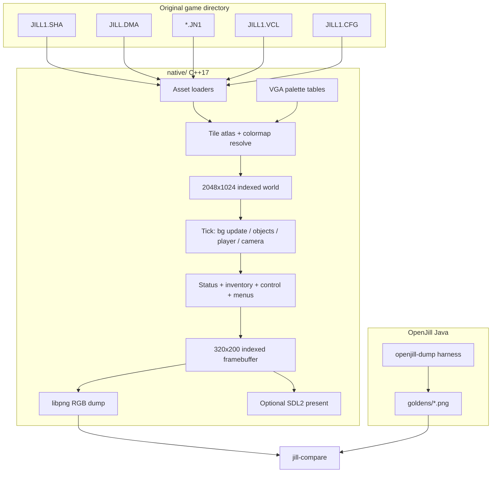
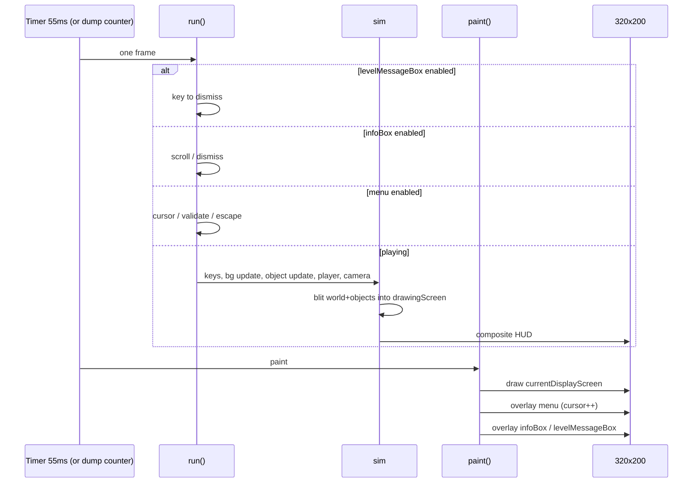
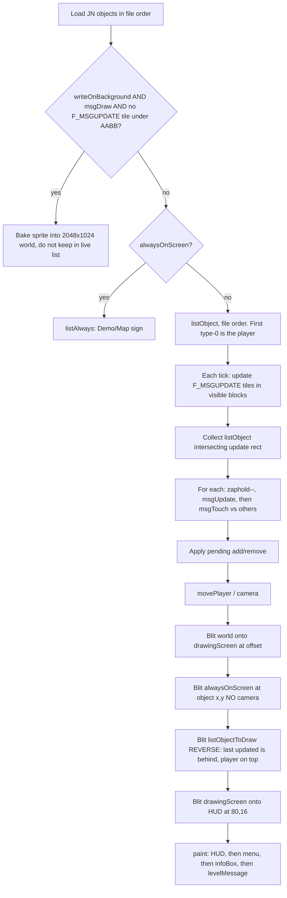

# Native C++ Port of Jill of the Jungle — Pixel-Identical to OpenJill

| Field | Value |
| --- | --- |
| **Document** | Native engine design (OpenJill parity) |
| **Author** | TBD |
| **Date** | 2026-08-14 |
| **Status** | Draft |
| **Reference engine** | OpenJill v0.2.7-SNAPSHOT (Java, MPL-2.0), archived at `/home/ted/Desktop/JILL/openjill` |
| **Reference assets** | Jill of the Jungle 1.2(d) shareware, 1993-12-27, `JILL.EXE` 219216 bytes |
| **Target tree** | `/home/ted/Desktop/JILL/native/` |

---

## Overview

OpenJill is a working but discontinued Java clone of Epic MegaGames’ *Jill of the Jungle*. It already plays the shareware episode on this machine at an internal resolution of **320×200**, zoomed ×2 for display, on a **55 ms** timer (≈ DOS 18.2 Hz). This document specifies a **native C++17 engine** that is **pixel-for-pixel identical to OpenJill**, not to DOSBox or the original VGA BIOS path.

The first deliverable is a **headless software renderer** plus a **golden-image harness**: load the same assets OpenJill uses, tick a deterministic number of frames, write a 320×200 PNG, and fail the build on the first differing pixel. An optional SDL2 window and a later Emscripten/WASM port share that same indexed backbuffer. **Sound and music are out of scope for v1**, but VCL/CMF hook points are reserved so the file layer is not painted into a corner.

OpenJill is the specification. Where OpenJill disagrees with the original DOS engine (unimplemented object types, baked VGA palette, no DMA flag XOR, “Open Jill : Jungle” chrome, Java ARGB compositing), **we copy OpenJill, including its bugs**.

---

## Background & Motivation

### Current state

| Piece | Location | Notes |
| --- | --- | --- |
| Shareware data | `/home/ted/Desktop/JILL/` | `JILL1.SHA` 260553 B, `JILL.DMA` 4160 B / 320 entries, `JILL1.VCL` 94954 B, `JILL1.CFG` 254 B, `*.JN1` maps, `*.DDT` CMF (unused) |
| OpenJill sources | `/home/ted/Desktop/JILL/openjill/` | Multi-module Maven tree; last tag `0.2.7-SNAPSHOT` |
| Runnable JAR | `/home/ted/Desktop/JILL/openjill/OpenJill/target/openjill-0.2.7-SNAPSHOT-bundle.jar` | Also copied next to the assets |
| Frame loop | `simplegame/.../SimpleGameJFrame.java` | `javax.swing.Timer(55)` → `handler.run()` → `repaint()` |
| Unscaled raster | `simplegame/.../SimpleGameScreen.java` | `BufferedImage initImage` **320×200 `TYPE_INT_ARGB`**, then `g2Resize.drawImage(..., 640, 400)` |
| Start handler | `StartMenuJill1Handler` | Loads `JILL1.SHA` + `INTRO.JN1` + `JILL1.VCL` + `JILL1.CFG` |

Verified launch:

```text
java -jar /home/ted/Desktop/JILL/openjill/OpenJill/target/openjill-0.2.7-SNAPSHOT-bundle.jar \
  jill.pathFile=/home/ted/Desktop/JILL/
```

Window title: `OpenJill v0.2.7-SNAPSHOT`. Internal res 320×200, `game.zoom=2`.

### Pain points

1. **Java runtime + Swing** is a poor long-term host (startup, packaging, WASM).
2. There is **no official dump of the 320×200 backbuffer**. A desktop screenshot captures window chrome and the zoomed 640×400 blit, which is **not** a valid compare surface.
3. OpenJill’s own tests (`sha-file/.../AppTest.java`, `dma-file/.../AppTest.java`, `jn-file/.../AppTest.java`) are print-and-extract scripts, not assertions. A native port needs **real golden tests against the shareware files**.
4. Audio is already unimplemented in OpenJill (`VclFileImpl` seeks to offset 400 and reads only the 40 text slots; `*.DDT` is never opened). We must not spend v1 budget there.

### Why “identical to OpenJill” and not DOSBox

Pixel identity against a running Java process is **mechanically testable** (same assets, same 55 ms tick, same object table). DOSBox identity would require reconstructing Turbo C rounding, AdLib side effects, and VGA latch behaviour that OpenJill itself does not attempt. The product goal is a **native OpenJill**, not a new reverse-engineering of `JILL.EXE`.

---

## Goals & Non-Goals

### Goals

- C++17 engine, CMake, no JVM in the shipped binary.
- **Byte-stable 320×200 indexed framebuffer** that, after expansion through OpenJill’s VGA palette, matches OpenJill’s unscaled `initImage` pixel-for-pixel.
- Load original shareware files in place (`--assets /home/ted/Desktop/JILL`). Do not convert or ship assets.
- Deterministic dump mode: select a scene, tick `N` frames, write `native.png`.
- Java golden capture of the **unscaled 320×200** raster (never the zoomed window).
- Compare tool: first mismatched `(x,y)`, expected/actual RGB, `diff.png`.
- Port OpenJill behaviour, including missing object types (skipped with a warning), HUD chrome, and known quirks.
- Linux first. Same renderer later compiled with Emscripten.
- Interactive SDL2 window **if headers exist**; PNG dump **must work without SDL2**.

### Non-goals (v1)

- Sound (VCL PCM) and music (CMF / `*.DDT`).
- CGA/EGA modes (OpenJill supports them; we implement **VGA only**, `jill.screen.type.default=VGA`).
- Episodes 2–3, editor, network.
- Pixel identity with DOSBox / original `JILL.EXE`.
- Copying OpenJill Java source or Xargon GPL C++.
- Shipping original assets.
- Perfect 18.2 Hz wall-clock in dump mode (dump is frame-counted, not timed).

---

## Key Decisions

| # | Decision | Rationale |
| --- | --- | --- |
| K1 | **OpenJill is the oracle**, including bugs | Product goal; DOS identity is untestable against the Java clone we actually run. |
| K2 | **320×200 indexed (`uint8`) software framebuffer**, palette-expanded only at PNG/SDL/WASM present | Makes compare trivial; matches VGA; WASM can `putImageData` the same RGB expand. |
| K3 | **Use OpenJill’s baked 8-bit VGA palette** (`jill_color_map.properties`), not the 6-bit block at `JILL.EXE+0x24A64` | EXE palette is 0..63; OpenJill’s RGB is already expanded and slightly “Jill-shaped” (`00A2A2`, `F7F7F7`, …). EXE expansion (`(c<<2)\|(c>>4)`) does **not** reproduce those bytes. |
| K4 | **Index 0 is transparent on blit, opaque black on clear** | `jill_color_map.properties` line 1 is `!000000` (`new Color(0, true)`). `TileManagerImpl` rebuilds `backgroundColor` as `new Color(colorMap[0].getRGB())` which drops alpha → opaque black fill. `SrcOver` with α=0 is a no-op. |
| K5 | **Do not XOR DMA flags** | Xargon XORs against `f_notvine\|f_notstair\|f_notwater`. OpenJill’s `BackgroundEntityImpl.init` tests the **stored** bits (`F_PLAYERTHRU=1`, `F_STAIR=2`, `F_VINE=4`, …). Sample `JILL.DMA` entry 0 has flags `513=0x0201`. XOR would invert physics. |
| K6 | **Golden capture without modifying OpenJill**: standalone Java harness that calls `handler.paint(g)` on a 320×200 `TYPE_INT_ARGB` | `AbstractMenuJillLevel.paint` already draws `currentDisplayScreen` at (0,0) then menu/info overlays. No JFrame, no zoom, works headless. Optional 10-line dump hook in `SimpleGameScreen` is a fallback, not required. |
| K7 | **Compare RGB888 after flatten**, never the zoomed window | Remaining ARGB holes (status-bar gaps never filled) flatten to `(0,0,0)`. Native dump emits the same RGB. |
| K8 | **PNG-first, SDL2 optional** | This box has `libpng-dev`, `g++`, `cmake`, Pillow 12.3, ImageMagick. `libsdl2-2.0-0` runtime is installed; **`libsdl2-dev` is not**. `find_package(SDL2)` may fail; dump/compare must not. |
| K9 | **C structs / generated tables, no JSON parser in v1** | OpenJill layout lives in `status_bar_vga.json`, `inventory_conf.json`, `start_menu.json`, `objects_manager_mapping.json`. We transcribe those numbers into `include/jill/tables/*.h` so the engine has zero runtime deps beyond libpng. |
| K10 | **Object vtable table keyed by `uint8 type`**, skip unmapped types | Mirrors `ObjectManager` + `objects_manager_mapping.json`. Unmapped types are logged and omitted — OpenJill already does this (`The object with type %d is not implemented`). |
| K11 | **World cache 2048×1024 indexed**, viewport copy into screen (80,16) 232×160 | Matches `AbstractBackgroundJillLevel.createBackgound` + `StatusBar.drawGameScreen`. |
| K12 | **Draw order is OpenJill’s, not “painter’s by z”** | Reverse-iterate `listObjectToDraw` so the first object (player) is on top; `alwaysOnScreen` draws first without camera; `writeOnBackGround` is baked at load. |
| K13 | **Tick then draw, once per frame** | `SimpleGameJFrame.actionPerformed`: `handler.run()` then `repaint()` → `paint()`. Menu cursor (`AbstractMenu.drawCursor`) advances **on paint**, so paint-count is part of the golden. |
| K14 | **Engine license MIT** (or MPL-2.0 if we want family alignment). Assets stay copyrighted. No Java/GPL paste. | Clean-room C++ guided by formats + observed OpenJill behaviour. |
| K15 | **Audio: parse VCL sound tables, store nothing playable** | Prevents a second breaking change to the VCL reader when audio lands. |

---

## Proposed Design

### High-level architecture



### Frame loop (must match OpenJill)

OpenJill’s contract, from `SimpleGameJFrame.actionPerformed` + `AbstractMenuJillLevel.run` + `AbstractExecutingStdLevel.doRunNext`:



Dump mode **does not sleep**. It executes the same `run`/`paint` pair `N` times.

**Turtle mode** (`T` key, `ControlArea.turtleMode`): `doRunNext` skips update+draw every other frame (`turtleSwitch` flip still happens). Goldens that enable turtle must count that.

### Screen layout (VGA, from `status_bar_vga.json` + `screen_game_area.txt`)

```
     0        8              72  80                         312 320
   0 +-----------------------------------------------------------+
     | status tileset 3 chrome  + big text "Open Jill : Jungle"  |
  16 | ctrl 64x85 | |  GAME AREA 232 x 160                       |
     |            | |  world copied here                          |
  96 |------------| |                                             |
 107 | inventory  | |                                             |
     | 64 x 69    | |                                             |
 176 | INVENTORY label + lower chrome                             |
 188 | message bar 320 x 12, color 0                              |
 200 +-----------------------------------------------------------+
```

| Region | Origin | Size | Source of truth |
| --- | --- | --- | --- |
| Full screen | (0,0) | 320×200 | `SimpleGameConfig` defaults |
| Game area | (80,16) | 232×160 | `status_bar_vga.json` `gameArea` |
| Control | (8,16) | 64×85 | same, `controlArea` |
| Inventory | (8,107) | 64×69, fill color 8 | `inventoryArea` |
| Message bar | (0,188) | 320×12, fill color 0 | `messageBar` |
| Camera dead-zone | right 88, left 96, top 32, bottom 80 | `gameArea.border` |
| Level-start centering | player − (120, 72) | `gameArea.levelStart` |
| Start-menu camera | tile (113, 54) → pixel offset (−1808, −864) | `StartMenuJill1Handler.centerScreen`: `-(112+1)*16`, `-(53+1)*16` |

Chrome tiles (all tileset **3**): upper bar tiles 2/4/3/10, mid-left junction 12, lower bar 5/6/8, verticals 0/9/11, right arrows 14/15. Implement by replaying the `images[]` array in `status_bar_vga.json` **in order** (later tiles overwrite earlier ones — tile 3 is stamped on top of tile 4 at (312,0), tile 11 on tile 9 at (72,96)).

Inventory **Jill face** (start menu only, `imagesInvenroy`): tileset **24**, 8-bit, 16 tiles in a 4×4 grid. **Tile 7 is at x=46, not x=48** — OpenJill overlaps that column on purpose.

### Module list and file layout

```text
/home/ted/Desktop/JILL/native/
  CMakeLists.txt
  cmake/FindSDL2.cmake          # optional
  include/jill/
    types.h                     # u8/u16/i16, packed structs
    error.h
    fs.h                        # join(asset_dir, name), case-insensitive open
    le.h                        # read_u8/u16/i16/u32 LE
    sha.h  dma.h  jn.h  vcl.h  cfg.h
    palette.h                   # 256 x RGB8 + transparent bit
    tile.h                      # atlas, colormap resolve, blit
    text.h
    framebuffer.h               # 320x200 + 2048x1024
    png_io.h
    hud.h  menu.h  camera.h
    object.h  player.h  sim.h
    tables/
      palette_vga.h             # transcribed from jill_color_map.properties
      dma_flags.h
      hud_layout.h              # status_bar_vga / inventory / control
      start_menu.h
      object_types.h
      object_conf.h             # from object_conf.json
  src/
    io/{le,fs,png_io}.cpp
    assets/{sha,dma,jn,vcl,cfg}.cpp
    render/{palette,tile,text,framebuffer}.cpp
    game/{sim,camera,object,player,collision}.cpp
    hud/{status,inventory,control,menu,infobox,highscore}.cpp
    objects/*.cpp               # one file per type, added per PR
    apps/{jill_dump,jill_compare,jill_play}.cpp
  tests/
    test_sha.cpp test_dma.cpp test_jn.cpp test_vcl.cpp test_cfg.cpp
    test_blit.cpp test_text.cpp test_hud.cpp
    CMakeLists.txt
  tools/openjill_dump/
    OpenJillDump.java
    README.txt                  # how to run against the bundle JAR
  goldens/                      # committed RGB PNGs, produced by the Java dump
    startmenu_f1.png
    startmenu_f8.png            # cursor wrap
    intro_bg_only.png           # optional mid-phase
```

CMake targets:

| Target | Type | Depends on SDL2? | Purpose |
| --- | --- | --- | --- |
| `jill_core` | static lib | no | loaders + renderer + sim |
| `jill-dump` | exe | no | `--assets --scene --frames --out` |
| `jill-compare` | exe | no | two PNGs → code 0/1 + diff |
| `jill-play` | exe | **yes** | interactive; omitted if `SDL2_FOUND` is false |
| `jill_tests` | exe | no | ctest against real shareware files |

`JILL_ASSET_DIR` CMake cache variable defaults to `${CMAKE_SOURCE_DIR}/..` (the directory that contains `JILL1.SHA`).

No `sudo apt`. If `libpng` is missing, fail configure with a clear message. If SDL2 headers are missing, skip `jill-play` and print a status line.

### Data structures

```cpp
// include/jill/types.h
#pragma once
#include <cstdint>
#include <cstddef>

using u8  = std::uint8_t;
using u16 = std::uint16_t;
using u32 = std::uint32_t;
using i16 = std::int16_t;
using i32 = std::int32_t;

constexpr int kScreenW = 320;
constexpr int kScreenH = 200;
constexpr int kBlock   = 16;
constexpr int kMapW    = 128;
constexpr int kMapH    = 64;
constexpr int kWorldW  = kMapW * kBlock; // 2048
constexpr int kWorldH  = kMapH * kBlock; // 1024
constexpr int kGameX   = 80, kGameY = 16, kGameW = 232, kGameH = 160;
constexpr int kObjBytes = 31;
constexpr int kSaveBytes = 70;
constexpr int kTickMs  = 55;
constexpr int kUpdatePadX = 96; // JillConst.xUpdateScreenBorder
constexpr int kUpdatePadY = 48;
```

```cpp
// SHA tileset (ShaTileSetImpl)
struct ShaTileset {
    int index;            // original header slot 0..127
    u8  num_shapes;
    u16 num_rots;         // ignored, usually 1
    u16 len_cga, len_ega, len_vga;
    u8  colour_bits;
    u16 flags;            // SHM_FONTF=1, SHM_BLFLAG=4
    bool font;
    bool has_colormap;    // !font && colour_bits < 8
    std::vector<u8> colormap; // (1<<bits)*4 bytes: CGA,EGA,VGA,0 per entry
    std::vector<struct ShaTile> tiles;
};

struct ShaTile {
    u8 w, h, type;        // type always 0 (BYTE) in Jill 1.2
    std::vector<u8> px;   // w*h, row-major
};

// DMA (DmaEntryImpl) — flags used as stored
struct DmaEntry {
    i16  code;            // map code, looked up with (jn_word & 0x0FFF)
    u8   tile;
    u8   tileset;         // already masked & 0x3F at load
    i16  flags;
    std::string name;
};

// JN object (ObjectItemImpl) — signed fields match Java readSigned16bitLE
struct Obj {
    u8  type;
    i16 x, y, xd, yd;
    u16 w, h;
    i16 state;
    u16 substate, statecount;
    i16 counter;
    u16 flags;
    u32 pointer;          // nonzero ⇒ consume next string-stack entry
    i16 info1;
    u16 zaphold;
    std::string str;      // bound at load, like JnFileImpl.readStringStack
    int index;
};

struct SaveBlock {        // 70 bytes
    u16 level;            // 0x7F = MAP
    u16 health;
    u16 ninv;
    u16 inv[16];
    u32 score;
    // 28 unused
};

struct JnMap {
    u16 tiles[kMapW][kMapH]; // already & 0x0FFF
    std::vector<Obj> objects;
    SaveBlock save;
    std::vector<std::string> strings;
};
```

**JN layout** (no header), from `JnFileImpl` + `BackgroundLayerImpl`:

1. 8192 × `UINT16LE` tiles, **column-major** `tiles[x][y]`, `x` in `[0,128)`, `y` in `[0,64)`. Offset `2*((x*64)+y)`. Mask `0x0FFF`.
2. `UINT16LE nobj`, then `nobj × 31` object bytes.
3. 70-byte save block.
4. String stack: `UINT16LE len`, `len` bytes, **plus a NUL**. Assign in order to objects with `pointer != 0`.

**Object 31-byte layout** (must use signed reads where OpenJill does):

| Off | Type | Field |
| --- | --- | --- |
| 0 | u8 | type |
| 1 | u16 | x |
| 3 | u16 | y |
| 5 | i16 | xd / xSpeed |
| 7 | i16 | yd / ySpeed |
| 9 | u16 | w |
| 11 | u16 | h |
| 13 | i16 | state |
| 15 | u16 | substate |
| 17 | u16 | statecount |
| 19 | i16 | counter |
| 21 | u16 | flags |
| 23 | u32 | pointer |
| 27 | i16 | info1 |
| 29 | u16 | zaphold |

**DMA entry** (`DmaFileImpl.readDmaEntry`): `{i16 code, u8 tile, u8 tileset&0x3F, i16 flags, u8 namelen, char name[namelen]}`. File has **320 entries**, 4160 bytes. Missing map codes fall back to code `0` (OpenJill logs `DmaEntry '%d' not found` and uses entry 0).

**SHA header**: 128 × `u32` offsets + 128 × `u16` sizes = 768 bytes. Valid iff `offset!=0 && size!=0`. This `JILL1.SHA` has **63 valid tilesets**, **1044 tiles**. First tileset is index **1** at offset 768 (index 0 is unused).

Tileset header at `offset`: `u8 numShapes, u16 numRots, u16 lenCGA, u16 lenEGA, u16 lenVGA, u8 numColourBits, u16 flags`. Colormap follows iff `!(flags&SHM_FONTF) && numColourBits < 8`, length `(1<<numColourBits)*4`.

This SHA’s 8-bit tileset is **only tileset 24** (Jill face, 16 tiles of 16×16, `SHM_BLFLAG`). There is **no embedded 768-byte palette** in that tileset; OpenJill maps 8-bit pixels through the global VGA table. We do the same. (The “64×12 8-bit palette override” from the original engine is **not** implemented in OpenJill and is therefore **not** in v1.)

Font tilesets on this disk:

| Index | Shapes | Bits | First tile | Use |
| --- | --- | --- | --- | --- |
| 1 | 128 | 2 | 8×8 | big text |
| 2 | 128 | 2 | 6×6 | small text, menu, HUD |
| 4 | 10 | 2 | 4×5 | high-score digits |
| 6 | 12 | 4 | 32×8 | SHIFT/ALT/F1 glyphs |

**CFG** 254 bytes (`CfgFileImpl`): 10 × 10-char high-score names, 20 unknown bytes, 10 × `i32` scores, 6 × 12-char save names, then 22-byte config. This file: `display=4` (VGA), `music=1`, `sound=1`.

**VCL**: 50 sounds (offset/len/freq) then 40 texts. OpenJill **skips 400 bytes** and compact-appends only nonempty texts. `StartMenuJill1Handler` uses `vclFile.getVclText().get(0)` = **first nonempty** slot, not slot 0. This file has **14 nonempty** texts. Native `Vcl` must expose both `by_slot[40]` and `nonempty[]` so message-box IDs match OpenJill’s compacted list.

### Palette and blit

Transcribe `/home/ted/Desktop/JILL/openjill/sha-file/src/main/resources/jill_color_map.properties` into `palette_vga.h` (256 RGB triples + `transparent[256]`). Index 0: RGB `(0,0,0)`, `transparent=true` for sprite blit.

Resolve a SHA pixel to a VGA index (VGA channel = byte 2 of each 4-byte colormap entry), matching `ShaTileImpl.getPicture`:

```cpp
u8 resolve_vga(const ShaTileset& ts, u8 raw) {
    if (!ts.has_colormap) return raw;
    const int off = int(raw) * 4 + 2;          // VGA_COLOR = 2
    if (off < int(ts.colormap.size())) return ts.colormap[off];
    return raw;                                 // OpenJill out-of-map fallback
}

void blit_sprite(Fb& dst, int dx, int dy, const ShaTile& t, const ShaTileset& ts,
                 bool skip_transparent = true) {
    for (int y = 0; y < t.h; ++y)
        for (int x = 0; x < t.w; ++x) {
            u8 idx = resolve_vga(ts, t.px[x + y * t.w]);
            if (skip_transparent && g_pal.transparent[idx]) continue;
            dst.pset(dx + x, dy + y, idx);
        }
}
```

Clip against dest. OpenJill `Graphics2D.drawImage` does not wrap; pixels off the `BufferedImage` are dropped.

**Fonts** (`TextManagerImpl.initColorTextMap`): each glyph is a 2-bit (or 4-bit for tileset 6) image whose raw values are 0..3.

| Raw | Meaning | VGA |
| --- | --- | --- |
| 0 | always transparent | — |
| 1, 2 | foreground | `foreColor + 8` (clamped to 15) |
| 3 | background | `backColor`, or transparent if `BACKGROUND_COLOR_NONE (-1)` |

Small text = tileset 2, tile index = ASCII code (space = 32, `'A'` = 65). Big text = tileset 1, same. High-score numbers = tileset 4, tiles 0–9. Special keys = tileset 6 (`SHIFT=0`, `ALT=1`, `F1=9`, bullets 10/11). Menu cursor = tileset 2, tiles **1..8**, cycled every **paint**.

Score digits in inventory (`InventoryArea.drawInventory`): convert score to decimal, blit glyphs **right-to-left** starting at `(57,16)`, color 4.

Lifebar (`inventory_conf.json` + `InventoryArea.drawLifeBar`):

- Default life 6, max 8.
- Start glyph tileset 14 tile 42 at (42, 2), step **3 px** (glyph is 4 px wide, last column unused).
- Draw `(life-1)` start glyphs, then end glyph (tile 43) at `40 + (life-1)*3` if `life>1`, else at 40.
- `life==0`: draw nothing. `life==1`: only the end glyph at (40,2).

Hit flash: inventory fill color 4 for **one** draw, then back to 8 (`backgroundHitPlayerColor`).

### Draw order (must be bit-identical)

From `AbstractObjectJillLevel.initObjectList` + `AbstractExecutingStdLevel.doRunNext` / `drawObject`:



`writeOnBackground` in OpenJill is set by the object class (`TextTileManager` types 20/21, `HugeLetterTileManager` type 42), **not** by `F_BACK`. Types 20/21/42 on `INTRO.JN1` are therefore baked once.

`alwaysOnScreen`: `DemoMapManager` type 67 concatenates tileset 3 tiles 16–19 (`DEMO`) or 20–22 (`MAP`) and stamps at its JN `x,y` every frame with **no camera offset**.

Camera (`AbstractExecutingStdPlayerLevel.centerScreen`):

```text
rightOffset = player.x + offset.x          # offset.x is negative
if rightOffset < border.right:             # 88
    offset.x = -max(player.x - 88, 0)
else if rightOffset > gameW - border.left: # 232-96=136
    offset.x = -min(player.x - 232 + 96, 2048-232)

# same for Y with top=32, bottom=80, gameH=160, worldH=1024
```

Look-up/down (`computeMoveScreen`): if player `state==0`, `type==0`, and `yd` is ≤ −2 (up) or ≥ 2 (down), ease `specialScreenShift` toward 0 or `3*16=48`. World blit uses `offset.y - specialScreenShift`.

Start menu **overrides** camera to (−1808, −864) and after the first `doRunNext` sets `runGame=false`, `menu.enable=true`. Subsequent ticks only animate the menu cursor.

### Simulation tick (playable levels)

Order inside `doRunNext` when `runGame && (!turtle || turtleSwitch)`:

1. `doPlayerFire` if fire latched.
2. `updateBackground` — visible tiles with `F_MSGUPDATE` (`flags & 32`), then redraw that 16×16 into the world cache.
3. `updateObject` — objects intersecting `visible + (96,48)`:
   - if `removeOutOfVisibleScreen` and fully off the **visible** rect → queue remove;
   - else `zaphold = max(0, zaphold-1)`, `msgUpdate(keyboard)`, append to `listObjectToDraw`, `msgTouch` every other currently-displayed object whose AABB intersects (including the player). Player is **not** double-updated via this path for keyboard; keyboard is consumed in `msgUpdate`.
4. `movePlayer` — `computeMoveScreen`, `centerScreen`, `keyboard.clear()`, then `msgTouch` every background cell under the player AABB.
5. Redraw inventory if dirty.
6. Composite as above.

Player physics (OpenJill `AbstractPlayerManager` + `PlayerJumpingConst` + `dokuwiki/pages/jill/algo/jump.txt`):

| Quantity | Value |
| --- | --- |
| Walk | 8 px/frame, only when `info1` already faces that way (one frame to turn) |
| `info1` / `xd` | −1 left, 0 face, +1 right |
| Jump windup | 3 frames (`substate` 0,1,2): `yd` stays at `-(16+4*highjump)`, **no** X move, **no** Y integrate |
| From frame `substate>=3` | apply `yd`, then `yd += 2`, cap fall at **+16** |
| Climb jump init | `yd = -12` |
| Floor hit | `state=STAND`, `stateCount=65529`, `counter=5` (land animation) |
| Climb | only if `x % 16 == 0` **and** some cell in the player AABB has `F_VINE` |
| Climb Y table | `{0,0,-6,-4,-4,-4}` indexed by `substate`; down = +4 |
| Head-up / squat | `yd = -3` / `+1` then `+3` while standing; these also drive `specialScreenShift` |

Collision (`UtilityObjectEntity`): a cell is solid if `!playerThru`, or if `playerThru && stair` when testing floors. Movement snaps to the block edge on hit (see `moveObjectUp/Down/Left/Right`). We port those functions **literally**, with the same inclusive/exclusive block-index arithmetic — this is the highest-risk pixel source after HUD chrome.

Begin state (`PlayerState.BEGIN=4`, used on `MAP.JN1`): `stateCount++` until 33; sprite is tileset 8 tiles 19/16/18, vertically cropped by `height - stateCount`.

### Object table (v1 coverage)

OpenJill `objects_manager_mapping.json` — **implement these, skip the rest**:

| Type | Class | INTRO | MAP | Notes |
| --- | --- | --- | --- | --- |
| 0 | PlayerManager | 3 | 1 | first is playable |
| 1 | AppleManager | 9 | 8 | tileset 9, 12 pts, +1 life |
| 2 | KniveManager | | | weapon |
| 12 | CheckPointManager | 12 | 14 | string stack: `*` song, `#` keep, `!` prev, else next JN |
| 14 | RedKeyManager | | 1 | |
| 15 | TouchTriggerManager | | 10 | |
| 20/21 | TextTileManager | 112+13 | 3+1 | baked into world |
| 22 | FrogManager | | | |
| 24 | LockedDoorManager | | 9 | |
| 25 | CollapsingCeilingManager | | 1 | |
| 26 | ToggleWallManager | | 8 | |
| 27 | PointManager | | | floating score |
| 28 | BonusManager | 4 | 1 | inventory by `counter` |
| 29–33, 35–40, 42, 45–51, 53, 56, 58, 61, 62, 64, 65, 67 | as mapped | 42,49 | 32,33,49,61,67 | incremental after goldens exist |

**Not in OpenJill** (native must also skip): 4,7,8,9,11,13,17,19,23,41,43,44,52,54,57,59,60,66. Logging them is required so a MAP/level dump does not invent sprites OpenJill never drew.

Sprite sheet indices for extractors live in `openjill/jn-file-extractor/src/main/resources/objects_picture_mapping.properties`. Runtime animation is **not** that file — it is each `*Manager` + `object_conf.json`. Native copies those numbers into `tables/object_conf.h`.

Background specials (`background_manager_mapping.properties`): `default → StdBackgroundEntity` (static blit). Named tiles (`MIST`, `WOODTORCH`, `LAVA*`, `SPIKE`, `MAPDOOR`, `FFLOOR`, …) have extra `msgDraw`/`msgUpdate`/`msgTouch`. Phase 2 may treat everything as `Std`; phase 6+ must port the named ones that appear on-screen in the current golden (INTRO is mostly static + text).

### HUD / start menu composition

After the first tick of `StartMenuJill1Handler`:

1. Status chrome + labels `CONTROLS` (color 1 @ 10,5), `INVENTORY` (1 @ 13,179), big `"Open Jill : Jungle"` (1 @ 129,4).
2. Inventory panel = Jill face (tileset 24), **not** the in-game inventory.
3. Control panel = **high-score table** (`HighScoreMenu` into the 64×85 buffer): fill color 8, line color 13 at y=10, `"HI SCORES"` color 4 at (5,2), names/scores from `JILL1.CFG` starting (2,15), name color 2, number color 6, tileset 4 digits.
4. Game area = INTRO world at camera (−1808, −864).
5. Menu at **(72, 64)** (`start_menu.json`): 9 items, title `"pick a choice :"`, 4 spaces before each label, frame tileset 7 tiles 1–9. Inner cell size `fontSizeSpace = 6+2 = 8`.
6. Cursor glyph cycles tileset 2 tiles 1–8, one step per `paint`.

`infoBox` is constructed with VCL nonempty[0] but **disabled** until menu value 3 (`instructions`). First-frame golden therefore has **no** info box.

### Deterministic dump CLI

```text
jill-dump --assets DIR --scene startmenu|intro|map|FILE.JN1 \
          --frames N --out native.png [--seed 0]
```

- `--scene startmenu` constructs the same state as `StartMenuJill1Handler` (INTRO + forced camera + one sim tick + menu enabled).
- `--frames N` = N pairs of `tick(); draw();`.
- Writes 320×200 RGB8 PNG via libpng (no alpha). Indexed fb is expanded with `palette_vga.h`. Unwritten pixels are 0 → RGB black.
- No wall clock, no RNG (OpenJill gameplay on these scenes does not call `Random` on the start menu). If a later object does, seed it.

`jill-play` (optional): present the same fb at integer scale 2 with `SDL_TEXTUREACCESS_STREAMING`, nearest neighbor, 55 ms delay. Input mapped to OpenJill’s `SimpleGameKeyHandler` (arrows, alt=fire, shift=jump, letters for menu).

### Golden capture (Java, no OpenJill source change)

New tiny program `native/tools/openjill_dump/OpenJillDump.java`, compiled against the **already built** bundle JAR:

```text
java -Djava.awt.headless=true \
  -cp native/tools/openjill_dump:openjill/OpenJill/target/openjill-0.2.7-SNAPSHOT-bundle.jar \
  org.jill.dump.OpenJillDump \
  --assets /home/ted/Desktop/JILL \
  --scene startmenu --frames 1 --out goldens/startmenu_f1.png
```

Algorithm (no JFrame, no zoom):

1. Build a `Properties` with `game.width=320`, `game.height=200`, `game.zoom=1`, `game.timer.delay=55`, `game.startClass=...StartMenuJill1Handler`, `game.configClass=...JillGameConfig`, `jill.pathFile=<assets>`, `jill.screen.type.default=VGA`.
2. `SimpleGameConfig.setInstance(new JillGameConfig(props))`.
3. `handler = new StartMenuJill1Handler();`  // loads assets, centers camera
4. Repeat `N` times: `handler.run();` then `handler.paint(g2)` into a fresh or reused 320×200 `TYPE_INT_ARGB`.
5. Flatten: for each pixel, if alpha==0 emit `(0,0,0)` else `(r,g,b)`.
6. `ImageIO.write(..., "png", out)`.

Why this is more reliable than Robot:

| Method | Problem |
| --- | --- |
| Robot of the Swing window | Includes WM decorations; captures **640×400** zoomed blit (`SimpleGameScreen` stretch). Downsample is not guaranteed equal to `initImage`. |
| Robot of client area + /2 | `Graphics2D.drawImage` scale is bilinear/bicubic depending on hints (OpenJill sets none → implementation-defined). |
| Hook `SimpleGameScreen.initImage` | Requires patching OpenJill; fine as optional, not needed. |
| **Direct `handler.paint` on 320×200** | Same method the panel calls when `zoom==1`. No window. Headless-safe. |

Optional 10-line hook (test-only, not required): in `SimpleGameScreen.paintComponent`, if `System.getProperty("jill.dump.path")` is set, `ImageIO.write(initImage, "png", ...)`. Useful for capturing *interactive* frames later. Keep it behind a property so the released OpenJill JAR stays untouched.

**Frame 1 vs frame 8:** menu cursor is a golden input. Commit both `startmenu_f1.png` (cursor tile 1) and `startmenu_f8.png` (wrap).

### Compare tool

```text
jill-compare goldens/startmenu_f1.png out/native.png --diff out/diff.png
```

- Decode both as RGB (flatten alpha if present).
- Require 320×200. Else error.
- Scan row-major. On first mismatch print `MISMATCH x=.. y=.. expected=#RRGGBB actual=#RRGGBB` and write a diff PNG (black = equal, magenta = differ, original in the G channel for context).
- Exit 0 if identical, 1 if differ, 2 if I/O.

ctest example:

```cmake
add_test(NAME startmenu_f1 COMMAND ${CMAKE_COMMAND} -E env
  ${CMAKE_COMMAND} -P cmake/run_golden.cmake
  --dump $<TARGET_FILE:jill-dump> --compare $<TARGET_FILE:jill-compare>
  --scene startmenu --frames 1 --gold ${CMAKE_SOURCE_DIR}/goldens/startmenu_f1.png)
```

### Audio hook points (do not implement)

```text
VCL layout:
  0x000  u32 sound_off[50]
  0x0C8  u16 sound_len[50]
  0x12C  u16 sound_hz[50]      // typically 6000
  0x190  u32 text_off[40]
  0x230  u16 text_len[40]
  0x280  unknown sequences
  then PCM (i8, headerless) and ASCII texts (first byte = style)

*.DDT = CMF AdLib. OpenJill never opens them.
```

`VclFile` in native:

```cpp
struct VclFile {
    struct SoundRef { u32 off; u16 len; u16 hz; }; // parsed, unused
    SoundRef sounds[50];
    std::string texts_by_slot[40];
    std::vector<std::string> nonempty; // OpenJill order
};
```

Do not link a mixer. Do not decode CMF. A later `jill_audio` target can consume `SoundRef` without touching callers.

### Legal

- Original `JILL.*` files remain copyright Epic MegaGames / Tim Sweeney (1992–93). The engine **reads them from a user-supplied `--assets` path** and never redistributes them.
- OpenJill is MPL-2.0. We treat it as a **behavioural reference**. Rewrite in C++. Do not paste Java. Do not copy Xargon (`x_player.cpp` etc.) — that tree is GPL and not in this workspace.
- Formats: document against [ModdingWiki SHA](https://www.shikadi.net/moddingwiki/SHA_Format), [DMA](https://www.shikadi.net/moddingwiki/DMA_Format), [Jill map](https://www.shikadi.net/moddingwiki/Jill_of_the_Jungle_Map_Format), [VCL](https://www.shikadi.net/moddingwiki/VCL_Format), [CFG](https://www.shikadi.net/moddingwiki/CFG_Format_(Jill_of_the_Jungle)) and OpenJill’s `dokuwiki/pages/jill/file_format/`.
- Recommended engine license: **MIT**, with `NOTICE` listing the format citations and “behaviour independently reimplemented from the OpenJill 0.2.7-SNAPSHOT reference.” MPL-2.0 is acceptable if we want copyleft on the engine itself.

---

## API / Interface Changes

No public C API in v1 beyond the three CLIs. Internal interface (the one every object implements):

```cpp
struct ObjectVTable {
    void (*init)(Obj* self, class Sim* sim);
    void (*update)(Obj* self, class Sim* sim, const struct Input* in);
    void (*touch)(Obj* self, Obj* other, class Sim* sim, const struct Input* in);
    // returns false if invisible (triggers cyan debug rect only if --show-invisible)
    bool (*draw)(const Obj* self, class Sim* sim, class Fb* dst, int camx, int camy);
    bool write_on_background;
    bool always_on_screen;
    bool is_player;
    bool remove_offscreen;
};

constexpr int kMaxType = 80;
extern const ObjectVTable* kTypeTable[kMaxType]; // nullptr = skip
```

Input is a **per-tick bitmask** (left/right/up/down/jump/fire/letters/escape/enter). Dump mode feeds zeros unless a later replay file is added.

There is **no Java API change** unless we land the optional `jill.dump.path` hook.

---

## Data Model Changes

None in the original files. Native is read-only toward SHA/DMA/JN/VCL/CFG.

In-memory only:

- 320×200 `u8` screen, 2048×1024 `u8` world (~2.06 MB).
- Tile atlas: ~1044 images, worst case ~1 MB of 8-bit pixels (tileset 8 is 75 frames, first 16×32).
- Object vector: INTRO has **167** objects, MAP **67**. Typical level < 200.

No migration. Save/load of `JN1SAVE.*` is a later PR (OpenJill already implements it in `AbstractChangeLevel`); schema is the JN file with a mutated object list + 70-byte save block.

---

## Alternatives Considered

### A. Render in RGB888 (or OpenGL) from day one

- **Pros:** No palette expand at present time; closer to OpenJill’s `TYPE_INT_ARGB`.
- **Cons:** Compare still needs a canonical 320×200; GPU sampling would destroy identity; WASM path becomes a GL subset. Indexed + expand is smaller and exact.

### B. Robot-screenshot OpenJill and downsample ×2

- **Pros:** Zero Java work.
- **Cons:** Window decorations, compositor, and `Graphics2D.drawImage` scale (no `RenderingHints` set in `SimpleGameScreen`) make this **non-deterministic across machines**. Explicitly rejected as the primary oracle.

### C. Patch OpenJill to dump `initImage`

- **Pros:** Captures exactly what the user sees in the running game.
- **Cons:** Requires maintaining a fork of a discontinued tree. Accepted only as an **optional** property hook. The standalone `handler.paint` harness is sufficient and cleaner.

### D. XOR DMA flags like Xargon

- **Pros:** Matches some original-engine write-ups.
- **Cons:** OpenJill does not XOR. Doing it would invert vine/stair/water on every tile and fail every physics golden. Rejected.

### E. Extract VGA palette from `JILL.EXE+0x24A64`

- **Pros:** “More original.”
- **Cons:** 6-bit values (`max==63` verified). OpenJill’s compare surface uses `jill_color_map.properties` (`A2`/`F7` channel values, not `A8`/`FC`). EXE palette is documented as a footnote, not used for blit.

### F. Embed a JSON parser and load OpenJill’s `*.json` at runtime

- **Pros:** One source of HUD numbers.
- **Cons:** Extra dependency; those JSON files are not a stable public API. Transcribing into `tables/*.h` (with a comment pointing at the JSON path) is enough. A later codegen script can refresh the headers.

---

## Security & Privacy Considerations

| Threat | Severity | Mitigation |
| --- | --- | --- |
| Path traversal via `--assets` / JN string-stack filenames (`12` checkpoint) | Medium | Resolve all file opens with `realpath` under the assets root; reject `..`. |
| Malformed SHA/JN (huge `numShapes`, huge string len) | Medium | Bound every count against remaining file size; `numShapes` ≤ 256; string len ≤ remaining-1. |
| Untrusted PNG in `jill-compare` | Low | libpng with fixed 320×200 check; no ancillary chunks used. |
| Cheats (`xxx` invincibility, `ggg` gem, `hhh` high-jump) | n/a | Port them; they are part of OpenJill. Not a security boundary. |
| PII | none | CFG high-score names stay local. |

No network. No telemetry.

---

## Observability

### Logging

- stderr, level `error|warn|info|debug` via `--log`.
- Always log: asset paths, tileset/object counts, skipped object types, missing DMA codes (with the same fallback-to-0 behaviour).
- `JILL_LOG=debug` env alias.

### Metrics (dump footer, optional `--stats`)

- frames, objects live, objects skipped, tiles dirty, ms elapsed (wall, informational only).

### Alerting / CI

- `ctest --output-on-failure` on every PR from phase 5 onward.
- Golden mismatch is a **hard fail**, not a warning. The compare tool’s first-pixel line is the triage handle.

### Debug overlays (off by default)

- `--show-invisible`: cyan dashed rect for objects with no sprite (OpenJill `drawDashedRectFilled`). Must be **off** in goldens.
- `--dump-world out.png`: the 2048×1024 cache, useful when the viewport is right but the camera is wrong.

---

## Rollout Plan

1. Land PRs 1–4 with unit tests only (no goldens yet).
2. Land Java dump + first committed goldens (`startmenu_f1`, `startmenu_f8`) **before** claiming HUD parity.
3. Gate every subsequent object PR on a new golden (or an explicit “no pixel change” compare of the start menu).
4. `jill-play` is opportunistic; never block dump/compare on SDL2.
5. WASM is a follow-up after `jill-dump` is green on all shareware JN files at frame 1.

### Feature flags

Compile-time: `JILL_WITH_SDL2`. Runtime: `--scene`, `--show-invisible`, `--no-hud` (debug), `--bg-only` (phase 2 goldens).

### Rollback

Goldens are the contract. Revert the offending PR; the previous binary must still match committed PNGs. Do not “fix” a golden to hide a regression unless OpenJill itself changed (it will not).

### Risks

| Risk | Sev | Mitigation |
| --- | --- | --- |
| AWT font/blit vs our blit off-by-one on menu chrome | High | Compare start menu first; if only cursor/glyphs differ, dump OpenJill glyphs as PNGs (sha-file already can) and unit-test `blit_sprite` against them. |
| `Graphics2D.drawImage` alpha vs our skip-on-0 | High | Flatten both sides; never store alpha in native PNG. |
| Camera sign error (OpenJill stores **negative** offset) | High | Unit-test start-menu offset == (−1808, −864) and the first on-screen tile. |
| Collision off-by-one vs `UtilityObjectEntity` | High | Port tests as table-driven cases from that file; delay player PR until bg+objects goldens pass. |
| Menu cursor advanced in `paint` not `run` | Med | Dump must call paint once per frame, same as Swing. |
| Unimplemented objects appearing in later levels | Med | Skip like OpenJill; per-level goldens document the holes. |
| SDL2 headers absent | Low | PNG path is the product for v1. |
| Case-sensitive paths (`jill.dma` vs `JILL.DMA`) | Low | `fs_open_ci` on Linux. This tree uses `JILL.DMA`, `JILL1.SHA`. |
| Headless AWT fails on the CI box | Med | Document `-Djava.awt.headless=true`; goldens are **committed**, so CI does not need to re-run Java unless refreshing. |

---

## Open Questions

1. **License bike-shed:** MIT (recommended) vs MPL-2.0. Needs a one-line owner call before PR 1.
2. **Do we ever want CGA/EGA?** Palette files exist (`cga_jill_color_map.properties`). Out of scope, but the blit already has a channel index (0=CGA, 1=EGA, 2=VGA) if we care later.
3. **Replay files** for player goldens (phase 6+): record input bitmasks per frame, or script a few canned walks? Recommend a trivial `*.inp` u8-per-frame file.
4. **Should skipped object types draw the cyan debug rect in dump?** OpenJill only does this with the `iii` cheat (`showInvisible`). Default **no**.
5. **Episode 2/3 SHA/DMA/VCL naming** (`JILL2.SHA`, …) — keep the loader filename-agnostic now; no need to decide packaging.

---

## References

- OpenJill frame loop: [`simplegame/src/main/java/org/simplegame/SimpleGameJFrame.java`](../openjill/simplegame/src/main/java/org/simplegame/SimpleGameJFrame.java), [`SimpleGameScreen.java`](../openjill/simplegame/src/main/java/org/simplegame/SimpleGameScreen.java)
- Paint / menu overlay: [`openjill-core/.../AbstractMenuJillLevel.java`](../openjill/openjill-core/src/main/java/org/jill/game/level/AbstractMenuJillLevel.java)
- Draw / update order: [`AbstractExecutingStdLevel.java`](../openjill/openjill-core/src/main/java/org/jill/game/level/AbstractExecutingStdLevel.java)
- Object list split: [`AbstractObjectJillLevel.java`](../openjill/openjill-core/src/main/java/org/jill/game/level/AbstractObjectJillLevel.java)
- Camera: [`AbstractExecutingStdPlayerLevel.java`](../openjill/openjill-core/src/main/java/org/jill/game/level/AbstractExecutingStdPlayerLevel.java)
- Start menu: [`StartMenuJill1Handler.java`](../openjill/openjill-core/src/main/java/org/jill/game/level/handler/jill1/StartMenuJill1Handler.java)
- HUD: [`StatusBar.java`](../openjill/openjill-core/src/main/java/org/jill/game/screen/StatusBar.java), [`InventoryArea.java`](../openjill/openjill-core/src/main/java/org/jill/game/screen/InventoryArea.java), [`status_bar_vga.json`](../openjill/OpenJill/src/main/resources/status_bar_vga.json), [`inventory_conf.json`](../openjill/OpenJill/src/main/resources/inventory_conf.json), [`control_area.json`](../openjill/OpenJill/src/main/resources/control_area.json)
- Loaders: [`ShaFileImpl.java`](../openjill/sha-file/src/main/java/org/jill/sha/ShaFileImpl.java) / [`ShaTileImpl.java`](../openjill/sha-file/src/main/java/org/jill/sha/ShaTileImpl.java), [`DmaFileImpl.java`](../openjill/dma-file/src/main/java/org/jill/dma/DmaFileImpl.java), [`JnFileImpl.java`](../openjill/jn-file/src/main/java/org/jill/jn/JnFileImpl.java), [`VclFileImpl.java`](../openjill/vcl-file/src/main/java/org/jill/vcl/VclFileImpl.java)
- Palette: [`jill_color_map.properties`](../openjill/sha-file/src/main/resources/jill_color_map.properties)
- Player: [`AbstractPlayerManager.java`](../openjill/open-jill-object-background/src/main/java/org/jill/game/entities/obj/player/AbstractPlayerManager.java), [`PlayerJumpingConst.java`](../openjill/open-jill-object-background/src/main/java/org/jill/game/entities/obj/player/PlayerJumpingConst.java), [`UtilityObjectEntity.java`](../openjill/open-jill-object-background/src/main/java/org/jill/game/entities/obj/util/UtilityObjectEntity.java), [`dokuwiki/pages/jill/algo/jump.txt`](../openjill/dokuwiki/pages/jill/algo/jump.txt)
- Screen doc: [`dokuwiki/pages/jill/other/screen_game_area.txt`](../openjill/dokuwiki/pages/jill/other/screen_game_area.txt)
- Object map: [`objects_manager_mapping.json`](../openjill/OpenJill/src/main/resources/objects_manager_mapping.json), [`objects_picture_mapping.properties`](../openjill/jn-file-extractor/src/main/resources/objects_picture_mapping.properties)
- ModdingWiki: SHA, DMA, Jill map, VCL, CFG formats (linked above)
- Constants: [`jill_const.properties`](../openjill/openjill-core-api/src/main/resources/jill_const.properties) (`blockSize=16`, `xUpdateScreenBorder=96`, `yUpdateScreenBorder=48`, `zapholdValueAfterTouchPlayer=3`)

### Measured facts for this tree

| Item | Value |
| --- | --- |
| `JILL.EXE` | 219216 bytes, VGA palette at `0x24A64` (768 bytes, 6-bit, **not used for blit**) |
| `JILL1.SHA` | 260553 B, 63 tilesets, 1044 tiles |
| `JILL.DMA` | 4160 B, 320 entries |
| `INTRO.JN1` | 25482 B, 167 objects, types {0,1,12,20,21,28,42,49}, save level=1 health=6 |
| `MAP.JN1` | 18685 B, 67 objects, types {0,1,12,14,15,20,21,24,25,26,28,32,33,49,61,67}, player at (96,40) 16×32 |
| `JILL1.VCL` | 94954 B, 14 nonempty texts |
| `JILL1.CFG` | 254 B, display=4, music=1, sound=1 |
| OpenJill timer / res / zoom | 55 ms / 320×200 / 2 |

---

## PR Plan

Each PR is independently reviewable and should merge green on `ctest`. Later PRs must not break earlier goldens.

### PR 1 — Repo skeleton, CMake, types, LE I/O

- **Title:** `native: CMake skeleton, types, little-endian I/O`
- **Files:** `native/CMakeLists.txt`, `include/jill/{types,error,fs,le}.h`, `src/io/{fs,le}.cpp`, `tests/test_le.cpp`, `NOTICE`, `LICENSE`
- **Depends on:** none
- **Description:** C++17, `-Wall -Wextra -Werror`, `JILL_ASSET_DIR`, case-insensitive `fs_open`. No game logic.

### PR 2 — SHA / DMA / JN / VCL / CFG loaders + unit tests

- **Title:** `native: asset loaders for SHA, DMA, JN, VCL, CFG`
- **Files:** `include/jill/{sha,dma,jn,vcl,cfg}.h`, `src/assets/*.cpp`, `tests/test_{sha,dma,jn,vcl,cfg}.cpp`
- **Depends on:** PR 1
- **Description:** Parse the real shareware files. Assert: 63 SHA tilesets, 1044 tiles, 320 DMA entries, INTRO `nobj==167`, MAP player `(96,40)`, CFG display==4, VCL `nonempty.size()==14`. Dump hex of first tileset header. Do not blit yet. Parse VCL sound tables into `SoundRef` and leave unused.

### PR 3 — Palette + indexed framebuffer + SHA blit

- **Title:** `native: VGA palette, framebuffer, SHA blit`
- **Files:** `include/jill/{palette,tile,framebuffer,png_io}.h`, `tables/palette_vga.h`, `src/render/*`, `src/io/png_io.cpp`, `src/apps/jill_dump.cpp` (tileset sheet mode), `tests/test_blit.cpp`
- **Depends on:** PR 2
- **Description:** Transcribe `jill_color_map.properties`. Implement `resolve_vga` + transparent-0 blit. `jill-dump --tileset 8 --out sheet.png` for manual inspection. Unit-test colormap fallback and 8-bit tileset 24.

### PR 4 — DMA tiles + JN background into 2048×1024

- **Title:** `native: world cache from JN + DMA`
- **Files:** `src/game/world.cpp`, `include/jill/world.h`, dump `--scene intro --bg-only`
- **Depends on:** PR 3
- **Description:** Fill world with color 0 (opaque), stamp every tile via DMA. Missing codes → DMA 0. Optional PNG of the full world or of the start-menu viewport rectangle `[1808,2040)×[864,1024)`.

### PR 5 — HUD chrome + text + inventory/control/high scores

- **Title:** `native: HUD, fonts, high-score panel`
- **Files:** `include/jill/{text,hud}.h`, `tables/hud_layout.h`, `src/hud/*`, `tests/test_text.cpp`
- **Depends on:** PR 3
- **Description:** Replay `status_bar_vga.json` tile list; small/big text; lifebar; inventory grid; control panel **or** high-score panel. No menu frame yet.

### PR 6 — Java golden harness + compare tool + start-menu scene (no menu chrome)

- **Title:** `native: openjill-dump, jill-compare, intro viewport golden`
- **Files:** `tools/openjill_dump/OpenJillDump.java`, `src/apps/jill_compare.cpp`, `goldens/intro_viewport_f1.png` (if we snapshot before menu — otherwise skip and wait for PR 7), `cmake/run_golden.cmake`
- **Depends on:** PR 4, PR 5
- **Description:** Headless Java `handler.paint` path documented above. Native `--scene startmenu --no-menu --frames 1` must match a Java dump taken the same way (may require a tiny `--no-menu` only on the native side; Java start menu always enables the menu after tick 1 — prefer PR 7 as the first **committed** golden).

### PR 7 — Start menu + info box + first committed goldens

- **Title:** `native: start menu parity (startmenu_f1 / f8)`
- **Files:** `include/jill/menu.h`, `tables/start_menu.h`, `src/hud/menu.cpp`, `src/game/sim_startmenu.cpp`, `goldens/startmenu_f{1,8}.png`
- **Depends on:** PR 5, PR 6
- **Description:** Menu frame, items, cursor cycle-on-paint. `StartMenuJill1Handler` camera and `runGame=false` after first tick. ctest fails on pixel mismatch. This is the first **hard** parity gate.

### PR 8 — Object sprites + draw-order (static)

- **Title:** `native: object blit, reverse draw order, writeOnBackground bake`
- **Files:** `include/jill/object.h`, `src/game/object.cpp`, `src/objects/{text,huge_letter,demo_map,apple,bonus,checkpoint}.cpp`, `tables/object_types.h`
- **Depends on:** PR 7
- **Description:** Load INTRO objects. Bake 20/21/42. Draw 0/1/12/28/49 with a **still** frame (no `msgUpdate`). Always-on-screen path ready (none on INTRO). Golden: `startmenu_f1` must stay green; add `intro_objects_f1.png` if any live sprite is visible in the viewport (player/apples/bonus may be).

### PR 9 — Player + collision + camera (MAP.JN1)

- **Title:** `native: player physics, collision, camera`
- **Files:** `src/game/{player,collision,camera}.cpp`, `src/objects/player.cpp`, `goldens/map_f1.png`, optional `goldens/map_walk_f30.png` + `replays/map_walk.inp`
- **Depends on:** PR 8
- **Description:** Port `UtilityObjectEntity` + stand/jump/climb/begin. Camera dead-zones. MAP player at (96,40), begin-state crop. `--scene map --frames 1`.

### PR 10 — Remaining OpenJill object types, per-level goldens

- **Title:** `native: object type X` (one PR per cluster: pickups, doors/triggers, enemies, weapons)
- **Files:** `src/objects/*.cpp`, `goldens/{1,2,3,4,6,9,50}_f1.png`
- **Depends on:** PR 9
- **Description:** Implement only types OpenJill implements. Each cluster updates the shareware-level frame-1 golden. Skip-list stays aligned with `objects_manager_mapping.json`.

### PR 11 — Optional SDL2 window

- **Title:** `native: optional jill-play (SDL2)`
- **Files:** `src/apps/jill_play.cpp`, `cmake/FindSDL2.cmake`
- **Depends on:** PR 9 (playable), soft-depends PR 10
- **Description:** `find_package(SDL2)` — if missing, skip target. Integer scale, nearest, 55 ms, keyboard. No audio.

### PR 12 — WASM (mention only, later)

- **Title:** `native: Emscripten port of jill-dump/jill-play`
- **Files:** `cmake` toolchain, `src/apps/jill_wasm.cpp`, HTML shell
- **Depends on:** PR 11 conceptually; can start from dump-only after PR 7
- **Description:** Same `jill_core`, same indexed fb, `EM_ASM`/`putImageData` RGB expand. Assets fetched or packed separately. **Not in v1.**

---

*End of draft. Implementation starts at PR 1; parity is not claimed before PR 7.*
